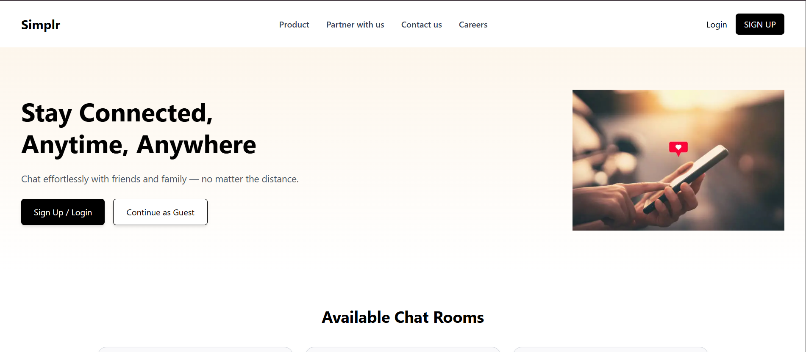

# 💬 Real-Time Chat Application

A web-based real-time chat application built using **React.js**, **Tailwind CSS**, and **Socket.io** (frontend only).  
The app provides an interactive interface for users to join chat rooms and exchange messages instantly.

---

## 🚀 Live Demo
🔗 [Click here to try the Chat App](https://chat-app-two-flax.vercel.app/)

---

## ✨ Features
- Enter a **username** before joining.  
- Join existing chat rooms or **create new ones**.  
- Exchange messages in **real time** with instant updates.  
- Messages include **sender’s name** and **timestamp**.  
- Supports basic **text formatting** (bold, italics, links).  
- Smooth scrolling and **responsive design** for all devices.  

---

## 🛠️ Technologies Used
- **React.js** – Component-based UI development.  
- **Tailwind CSS** – Modern, utility-first styling.  
- **Socket.io (frontend)** – Real-time communication handling.  
- **JavaScript (ES6+)** – Core logic and interactivity.  

---

## 📷 Screenshot


---

## ⚡ How to Clone and Run Locally
```bash
# Clone the repository
git clone https://github.com/chetturuKhaleel1/chat-app.git

# Navigate into the project folder
cd chat-app

# Install dependencies
npm install

# Start the frontend
npm start
